#### C Matrix

#### C header for matrix calc and manipulation

### Headers
- #### stdio 
- #### stlib
- #### stdint
- #### stdarg
- #### limits
- #### math

### Matrix datatype

```C
// A new type is used to reduces reading complexity.

typedef struct{
    uint32_t rows;
    uint32_t columns;
    uint32_t slices;
    double ***data;
}MATRIX;
```

### Modes
- ### Fill modes
    - #### FILLED
    - #### NOT FILLED
``` 
Indicates if initialized matrix will receive a fill array or not. Used in function matrix_init.
```

- ### Iterate modes
``` 
Indicates the way as functions will process the matrix.
```
-
    - #### ALL
        ```
        Process all elements of matrix.
        ```
    - #### BY_ROW
        ```
        Process all elements of espefied rows and slices of matrix.
        ```
    - #### BY_COLUMN
        ```
        Process all elements of espefied columns and slices of matrix.
        ```
    - #### BY_SLICE
        ```
        Process all elements of espefied slices of matrix.
        ```
    - #### CUSTOM
        ```
        Process especifc elements of matrix.
        ```
- ### Extract modes
```
Indicates how will be the shape of matrix after matrix_pop function.
```

- - #### KEEP_ROWS_SIZE
    ```
    If you pop columns, the popped values will be replaced by zeros and the shape remain the same.
    ```
  - #### KEEP_COLUMNS_SIZE
    ```
    If you pop rows, the popped values will be replaced by zerosand the shape remain the same.
    ```
  - #### KEEP_SLICES_SIZE
    ```
    If you pop a entire slice, that slice values will be replaced by zeros and the shape remain the same.
    ```
  - #### CUT
    ```
    Cut mode will reshape the remaining matrix, removing popped rows, columns or slices.
    ```
- ### Return modes
```
Indicates if the function will returns a new a matrix pointer or free and replace already existing matrix.
```
- - #### INPLACE
    ```
    Replace input matrix with the result.
    ```
  - #### NEW
    ```
    Returns a new dynamically allocated matrix pointer.
    ```
### Operations
```
Used for term by term operations between matrices.
```
- - #### SUM
  - #### SUB
  - #### MULT
  - #### DIVIDE
  - #### POWER

### Functions

- ### Math functions (2 param)

    ```C
    double divide(double x, double y);
    static inline double sum(double x, double y);
    static inline double sub(double x, double y);
    static inline double mult(double x, double y);
    ```

- ### Bool functions (2 param)
    ```C
    static inline double is_bigger(double x, double y);
    static inline double is_smaller(double x, double y)
    static inline double is_different(double x, double y)
    static inline double is_equal(double x, double y)
    ```

- ### Array funcitions
    - ### arr
    ```C
    double* arr(uint32_t size, ...);

    Return a dynamically allocated array with a sequence of passed numbers.
    OBS: va_arg receives double values.

    //Ex

    arr(4, 2.0, 5.0, 1.0, 0.0);
    -> [2.0 5.0 1.0 0.0]
    ```

    - ### int_arr
    ```C
    int* int_arr(uint32_t size, ...);

    Return a dynamically allocated array with a sequence of passed numbers.
    OBS: va_arg receives int values.

    //Ex

    arr(4, 2, 5, 1, 0);
    -> [2 5 1 0]
    ```
    - ### int_a_b
    ```C
    int32_t* int_a_b(int32_t start, int32_t end, int32_t step);

    Return a dynamically allocated array with a serie of numbers regular spaced.
    The result array size can be calculated by: [(end - start)/step] + 1

    //Ex

    arr(0, 4, 1);
    -> [0 1 2 3 4]

    arr(-4, 0, 1);
    -> [-4 -3 -2 -1 0]

    arr(0, 4, 2);
    -> [0 2 4]
    ```
    - ### double_linspace
    ```C
    double* double_linspace(double start, double end, uint32_t size);

    Return a dynamically allocated array with a serie of numbers regular spaced.
    OBS: If size = 1, functions return an array with start value.

    //Ex

    arr(0.0, 4.0, 5);
    -> [0 1 2 3 4]

    arr(-4, 4, 5);
    -> [-4 -2 0 2 4]

    arr(1, 4, 1);
    -> [1]
    ```
    - ### array_dot
    ```C
    double array_dot(const double* a, const double* b, uint32_t size);

    Return the dot product of two arrays.
    ```
    See [Dot Product](https://en.wikipedia.org/wiki/Dot_product).
    
- ### Matrix functions
    - ### matrix_free
    ```C
    void matrix_free(MATRIX *matrix);

    Free memory of matrix pointer.

    //Ex
    MATRIX* matrix;
    matrix_free(matrix);
    ```
    - ### matrix_vfree
    ```C
    void matrix_vfree(uint32_t count, ...);

    Free memory of a sequence of matrices.

    Parameters
    count: number of matrices.
    ...: va_arg receives MATRIX* values.

    //Ex
    MATRIX *a, *b, *c;
    matrix_vfree(3, a, b, c);
    ```
    - ### matrix_print
    ```C
    void matrix_print(const MATRIX a);

    Print matrix slice by slice.

    //Ex - matrix 2x2x2
    MATRIX *a = matrix_init(2,2,2,FILLED,arr(8, 1.0,2.0,3.0,4.0,5.0,6.0,7.0,8.0));
    matrix_print(*a);
    ```
    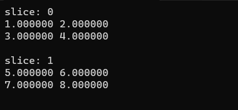
    - ### matrix_info
    ```C
    void matrix_info(const MATRIX matrix);

    Print dimensions of matrix.

    //Ex - matrix 2x2x2
    MATRIX *a = matrix_init(2,2,2,FILLED,arr(8, 1.0,2.0,3.0,4.0,5.0,6.0,7.0,8.0));
    matrix_info(*a);
    ```
    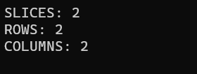
    - ### matrix_init
    ```C
    MATRIX* matrix_init(uint32_t rows, uint32_t columns, uint32_t slices, uint8_t filled, ...);

    Create a MATRIX* pointer dynamically allocated.

    Parameters
    rows: rows count.
    columns: columns count.
    slices: slices count.
    filled: receive FILLED or NOT_FILLED.
            If filled = FILLED, the function expects a double* array with length
            rows x columns x slices, which will fill the matrix row by row.
            If filled = NOT_FILLED, the matrix will be initialized with zeros.
    ...: va_arg receive a double* array.

    //Ex - filled matrix
    MATRIX *a = matrix_init(2,2,2,FILLED,arr(8, 1.0,2.0,3.0,4.0,5.0,6.0,7.0,8.0));
    matrix_print(*a);

    //Ex - not filled (empty) matrix
    MATRIX *b = matrix_init(3,3,2,NOT_FILLED);
    matrix_print(*b);     
    ```
    
    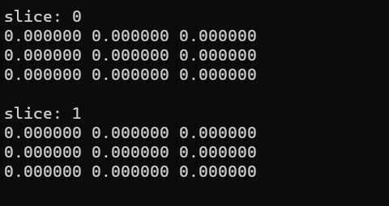
    - ### matrix_ones
    ```C
    MATRIX* matrix_ones(uint32_t rows, uint32_t columns, uint32_t slices);

    Create a MATRIX* pointer dynamically allocated filled with ones.

    Parameters
    rows: rows count.
    columns: columns count.
    slices: slices count.

    //Ex - 3x3x2 matrix
    MATRIX *a = matrix_ones(3,3,2);
    matrix_print(*a);
    ```
    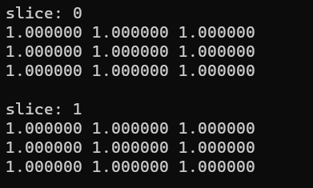
    - ### matrix_transfer
    ```C
    void matrix_transfer(const MATRIX a, MATRIX *b);

    Transfer the data*** pointer from a to b, without preserve dimensions.
    (b matrix can be bigger or equal than a matrix, but not smaller);
    ```
    ```C
    //Ex - dim(b) == dim(a)

    MATRIX *a = matrix_ones(3,3,2);
	MATRIX *b = matrix_init(3,3,2,NOT_FILLED);
	
	matrix_transfer(*a, b);
	matrix_print(*b);
    ```
     == dim(a)")
    ```C
    //Ex - dim(b) > dim(a)

    MATRIX *a = matrix_ones(2,2,2);
	MATRIX *b = matrix_init(3,3,2,NOT_FILLED);
	
	matrix_transfer(*a, b);
	matrix_print(*b);
    ```
     > dim(a)")
    - ### matrix_copy
    ```C
    MATRIX* matrix_copy(const MATRIX input_matrix);

    Return a new and equal MATRIX* pointer dynamically allocated.

    //Ex

    MATRIX *a = matrix_ones(2,2,2);
    MATRIX* b = matrix_copy(*a);

    matrix_print(*b);
    ```
    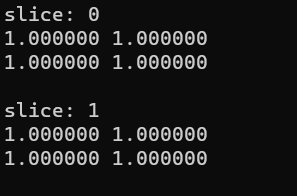
    - ### matrix_tranpose
    See [Matrix Transpose](https://en.wikipedia.org/wiki/Transpose)
    ```C
    MATRIX* matrix_transpose(MATRIX** input_matrix, int8_t return_mode, uint8_t iterate_mode,...);

    Transpose the matrix.

    Parameters
    return_mode: INPLACE or NEW
                INPLACE - free the input_matrix and replace by transposed matrix.
                NEW - return a new MATRIX* pointer dynamically allocated.

    iterate_mode: ALL or CUSTOM
                ALL - transpose all slices of input matrix.
                CUSTOM - transpose just selected slices.

    ...         : (enable if CUSTOM is selected in iterate mode)
                first arg - slices count.
                second arg - int* array with slices numbers.
    ```
    ```C
    //EX

    MATRIX *a = matrix_init(3,4,1, FILLED, double_linspace(1.0,12.0,12));
	matrix_print(*a);
	
	a = matrix_transpose(&a, INPLACE, ALL);
	matrix_print(*a);
    ```
    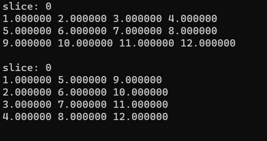
    - ### matrix_reshape
    ```C
    MATRIX* matrix_reshape(MATRIX** input_matrix, uint32_t new_rows, uint32_t new_columns, uint32_t new_slices, int8_t return_mode);

    Map the columns of input matrix to columns of output matrix in new dimensions. Note that, element count in output matrix must be the same.

    Parameters
    return_mode: INPLACE or NEW
                INPLACE - free the input_matrix and replace by transposed matrix.
                NEW - return a new MATRIX* pointer dynamically allocated.
    ```
    ```C
    //Ex 1

    #include "c_matrix.h"

    int main(){
	    MATRIX *a = matrix_init(3,4,1, FILLED, double_linspace(1.0,12.0,12));
	    matrix_print(*a);
	
	    a = matrix_reshape(&a,4,3,1,INPLACE);
	    matrix_print(*a);
	
	    matrix_free(a);
	
	    return 0;                       
    }
    ```
    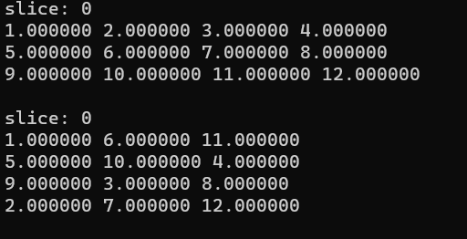
    ```C
    //Ex 2

    #include "c_matrix.h"

    int main(){
	    MATRIX *a = matrix_init(3,4,1, FILLED, double_linspace(1.0,12.0,12));
	    matrix_print(*a);
	
	    a = matrix_reshape(&a,2,2,3,INPLACE);
	    matrix_print(*a);
	
	    matrix_free(a);
	
	    return 0;                       
    }
    ```
    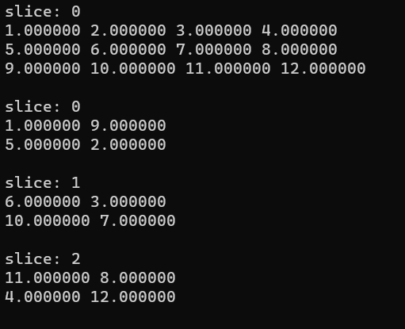
    - ### matrix_expand
    ```C
    MATRIX* matrix_expand(MATRIX** input_matrix, uint8_t expand_mode, uint16_t count, int8_t return_mode);

    Add new dimensions to matrix. New dimensions are filled with zeros.

    Parameters
    expand_mode: ADD_COLUMNS, ADD_ROWS or ADD_SLICES.
    count      : columns, rows or slices count.
    return_mode: INPLACE or NEW
                INPLACE - free the input_matrix and replace by transposed matrix.
                NEW - return a new MATRIX* pointer dynamically allocated.
    ```
    ```C
    //Ex

    #include "c_matrix.h"

    int main(){
	    MATRIX *a = matrix_init(3,4,1, FILLED, double_linspace(1.0,12.0,12));
	    matrix_print(*a);
	
	    a = matrix_expand(&a, ADD_ROWS, 1, INPLACE);
	    matrix_print(*a);
	
	    matrix_free(a);
	
	    return 0;                       
    }
    ```
    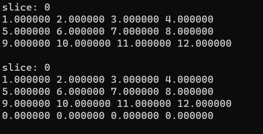
    ```C
    //Ex

    #include "c_matrix.h"

    int main(){
	    MATRIX *a = matrix_init(3,4,1, FILLED, double_linspace(1.0,12.0,12));
	    matrix_print(*a);
	
	    a = matrix_expand(&a, ADD_SLICES, 1, INPLACE);
	    matrix_print(*a);
	
	    matrix_free(a);
	
	    return 0;                       
    }
    ```
    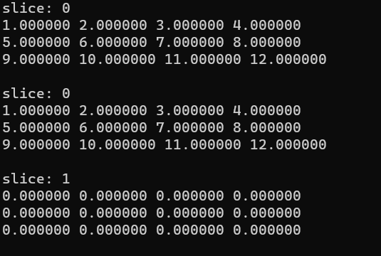
    - ### matrix_pop
    ```C
    MATRIX* matrix_pop(MATRIX** input_matrix, int8_t return_mode, uint8_t extract_mode, uint8_t iterate_mode, ...);

    Return a segment of input matrix.

    Parameters
    return_mode : INPLACE or NEW
                INPLACE - free the input_matrix and replace by transposed matrix.
                NEW - return a new MATRIX* pointer dynamically allocated.

    //KEEP MODES ARE NOT IMPLEMENTED YET.
    extract_mode: KEEP_ROWS_SIZE, KEEP_COLUMNS_SIZE, KEEP_SLICES_SIZE or CUT
                KEEP... - popped segment will be replaced by zeros.
                CUT - popped segment will be excluded from input matrix.
                (dimesion reduction).

    iterate_mode: BY_ROW, BY_COLUMN, BY_SLICE or CUSTOM
                BY_ROW - selected rows will be popped out.
                BY_COLUMN - selected columns will be popped out.
                BY_SLICE - selected slices will be popped out.
                CUSTOM - custom rows, columns and slices will be popped out.
    
    ...         : aditional info according iterate mode.
                BY_ROW :
                        first argument - rows count.
                        second argument - int* array with rows numbers.
                BY_COLUMN :
                        first argument - columns count.
                        second argument - int* array with columns numbers.
                BY_SLICE :
                        first argument - slices count.
                        second argument - int* array with slices numbers.
                CUSTOM  :
                        first argument - int* array with {rows_count, columns_count, slices_count}.
                        second argument - int* array with rows numbers.
                        third argument - int* array with columns numbers.
                        fourth argument - int* array with slices numbers.
    ```
    ```C
    //Ex - with cut

    #include "c_matrix.h"

    int main(){
	    MATRIX *a = matrix_init(3,4,1, FILLED, double_linspace(1.0,12.0,12));
	    matrix_print(*a);
	
	    a = matrix_pop(&a, INPLACE, CUT, BY_ROW, 2, int_arr(2,1,2));
	    matrix_print(*a);
	
	    matrix_free(a);
	
	    return 0;                       
    }
    ```
    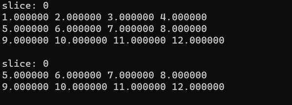
    - ### matrix_add
    ```C
    MATRIX* matrix_add(MATRIX** a,const MATRIX b, int8_t return_mode, uint8_t iterate_mode, ...);
    
    Add two matrices

    Parameters
    return_mode: INPLACE or NEW
                INPLACE - free the input_matrix and replace by transposed matrix.
                NEW - return a new MATRIX* pointer dynamically allocated.
    
    iterate_mode: ALL, BY_ROW, BY_COLUMN, BY_SLICE or CUSTOM
                ALL - sum all elements.
                BY_ROW - sum specified rows.
                BY_COLUMN - sum specified columns.
                CUSTOM - sum specified rows, columns and slices
    
    ...         : aditional info according iterate mode.
                BY_ROW:
                        first argument - rows count.
                        second argument - int* array with rows numbers.
                BY_COLUMN:
                        first argument - columns count.
                        second argument - int* array with columns numbers.
                BY_SLICE:
                        first argument - slices count.
                        second argument - int* array with slices numbers.
                CUSTOM:
                        first argument - int* array with {slices_count, rows_count, columns_count}.
                        second argument - int* array with rows numbers.
                        third argument - int* array with columns numbers.
                        fourth argument - int* array with slices numbers.
    ```
    ```C
    //Ex

    #include "c_matrix.h"

    int main(){
	    MATRIX *a = matrix_init(3,4,1, FILLED, double_linspace(1.0,12.0,12));
	    matrix_print(*a);
	
	    MATRIX *b = matrix_ones(3,4,1);
	    matrix_print(*b);
	
	    MATRIX *c = matrix_add(&a, *b, NEW, ALL);
	    matrix_print(*c);
	
	    matrix_vfree(3,a,b,c);
	
	    return 0;                       
    }
    ```
    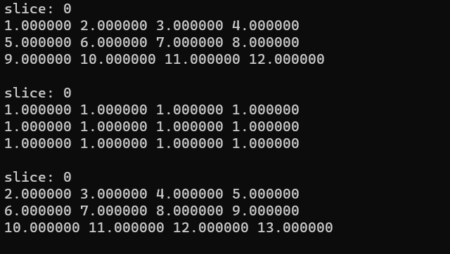
    - ### matrix_product
    See [Matrix Multiplication](https://en.wikipedia.org/wiki/Matrix_multiplication)
    ```C
    MMATRIX* matrix_product(MATRIX** a, const MATRIX b, int8_t return_mode, uint8_t iterate_mode, ...);

    Matrix multiplication.

    Parameters
    return_mode: INPLACE or NEW
                INPLACE - free the input_matrix and replace by transposed matrix.
                NEW - return a new MATRIX* pointer dynamically allocated.
    
    iterate_mode: ALL or BY_SLICE
                ALL - product between all slices.
                BY_SLICE - product between specified slices.
    
    ...         : aditional info according iterate mode.
                BY_SLICE:
                        first argument - slices count.
                        second argument - int* array with slices numbers.
    ```
    ```C
    //Ex 1

    #include "c_matrix.h"

    int main(){
	    MATRIX *a = matrix_init(1,4,1, FILLED, double_linspace(1.0,4.0,4));
	    matrix_print(*a);
	
	    MATRIX *b = matrix_ones(4,1,1);
	    matrix_print(*b);
	
	    MATRIX *c = matrix_product(&a, *b, NEW, ALL);
	    matrix_print(*c);
	
	    matrix_vfree(3,a,b,c);
	
	    return 0;                       
    }
    ```
    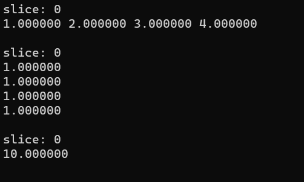
    ```C
    //Ex 2

    #include "c_matrix.h"

    int main(){
	    MATRIX *a = matrix_init(1,4,1, FILLED, double_linspace(1.0,4.0,4));
	    matrix_print(*a);
	
	    MATRIX *b = matrix_ones(4,1,1);
	    matrix_print(*b);
	
	    MATRIX *c = matrix_product(&b, *a, NEW, ALL);
	    matrix_print(*c);
	
	    matrix_vfree(3,a,b,c);
	
	    return 0;                       
    }
    ```
    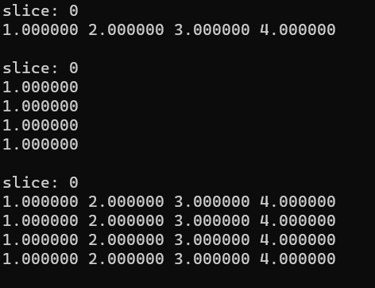
    - ### matrix_sum
    ```C
    MATRIX* matrix_sum(MATRIX** input_matrix, int8_t iterate_mode, int8_t return_mode);

    Return the sum of inner elements of matrix.

    Parameters
    return_mode: INPLACE or NEW
                INPLACE - free the input_matrix and replace by transposed matrix.
                NEW - return a new MATRIX* pointer dynamically allocated.
    
    iterate_mode: ALL, BY_ROW, BY_COLUMN, BY_SLICE or CUSTOM
                ALL - sum all elements, return 1x1x1 matrix.
                BY_ROW - sum specified n rows, return nx1xm matrix.
                BY_COLUMN - sum specified n columns, return 1xnxm matrix.
                BY_SLICE - sum specified n slices, return kxmx1 matrix.
                CUSTOM - sum specified rows, columns and slices.
    ```
    ```C
    //Ex 

    #include "c_matrix.h"

    int main(){
	    MATRIX *a = matrix_init(2,2,1, FILLED, double_linspace(1.0,4.0,4));
	    matrix_print(*a);
	
	    matrix_print(*matrix_sum(&a, ALL, NEW));
	    matrix_print(*matrix_sum(&a, BY_ROW, NEW));
	    matrix_print(*matrix_sum(&a, BY_COLUMN, NEW));
	    matrix_print(*matrix_sum(&a, BY_SLICE, NEW));
	
	    matrix_free(a);
	
	    return 0;                       
    }
    ```
    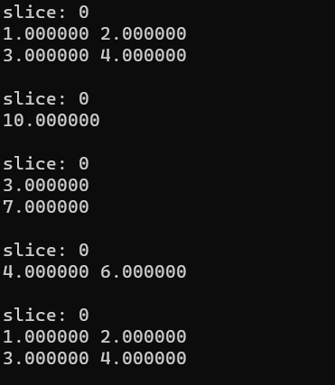
    - ### matrix_1by1
    ```C
    MATRIX* matrix_1by1(MATRIX** a, const MATRIX b, uint8_t operation, int return_mode);

    Realize operations element by element between matrices of same dimension.

    Parameters
    return_mode: INPLACE or NEW
                INPLACE - free the input_matrix and replace by transposed matrix.
                NEW - return a new MATRIX* pointer dynamically allocated.

    operation: SUM, SUB, MULT, DIVIDE or POWER
    ```
    ```C
    //Ex

    #include "c_matrix.h"

    int main(){
	    MATRIX *a = matrix_init(2,2,1, FILLED, arr(4, 2.0,2.0,2.0,2.0));
	    MATRIX *b = matrix_init(2,2,1, FILLED, arr(4, 1.0,2.0,3.0,4.0));
	    matrix_print(*b);
	
	    matrix_print(*matrix_1by1(&a, *b, SUM, NEW));
	    matrix_print(*matrix_1by1(&a, *b, SUB, NEW));
	    matrix_print(*matrix_1by1(&a, *b, MULT, NEW));
	    matrix_print(*matrix_1by1(&a, *b, DIVIDE, NEW));
	    matrix_print(*matrix_1by1(&a, *b, POWER, NEW));
	
	    matrix_free(a);
        matrix_free(b);
	
	    return 0;                       
    }
    ```
    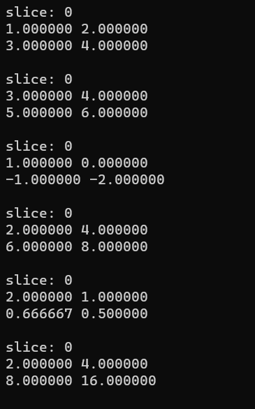
    - ### matrix_iterate
    ```C
    MATRIX* matrix_iterate(MATRIX** input_matrix, double (*action)(double, double), double y, int8_t return_mode, uint8_t iterate_mode, ...);

    Applies a function on matrix elements.

    Parameters
    (*action)(double, double): receive any function with two double param and with double as return.
                               
    y                        : receive a number wich can be passed as parameter to action function.
                               OBS: The function does not necessarily need to use this number.

    return_mode              : INPLACE or NEW
                INPLACE - free the input_matrix and replace by transposed matrix.
                NEW - return a new MATRIX* pointer dynamically allocated.

    iterate_mode             : ALL, BY_ROW, BY_COLUMN or CUSTOM
                             ALL - apply f over all elements
                             BY_ROW - apply f over specified rows.
                             BY_COLUMN - apply f over specified columns.
                             CUSTOM - apply f over specified rows, columns and slices.

    ...                      : aditional info according iterate mode.
                            BY_ROW:
                                first argument - rows count.
                                second argument - int* array with rows numbers.
                            BY_COLUMN:
                                first argument - columns count.
                                second argument - int* array with columns numbers.
                            BY_SLICE: //not implemented yet
                                first argument - slices count.
                                second argument - int* array with slices numbers.
                            CUSTOM:
                                first argument - int* array with {slices_count, rows_count, columns_count}.
                                second argument - int* array with rows numbers.
                                third argument - int* array with columns numbers.
                                fourth argument - int* array with slices numbers.

    ```
    $$Let\:A,\:a\:matrix,\:apply\:f\left(A,\:y\right):$$

    ```
    iterate_mode = ALL
    ```
    $$A\:=\:\begin{pmatrix}a&b&c\\ d&e&k\\ g&h&i\end{pmatrix}\:\:\:\:\rightarrow \:\:\:\:f\left(A,y\right)\:\rightarrow \:\:\begin{pmatrix}f\left(a,y\right)&f\left(b,y\right)&f\left(c,y\right)\\ f\left(d,y\right)&f\left(e,y\right)&f\left(k,y\right)\\ f\left(g,y\right)&f\left(h,y\right)&f\left(i,y\right)\end{pmatrix}
    $$

    ```
    iterate_mode = BY_COLUMN
    ```
    $$A\:=\:\begin{pmatrix}a&b&c\\ d&e&k\\ g&h&i\end{pmatrix}\:\:\:\:\rightarrow \:\:\:\:f\left(A,y\right)\:\rightarrow \:\:\begin{pmatrix}a&f\left(b,y\right)&f\left(c,y\right)\\ d&f\left(e,y\right)&f\left(k,y\right)\\ g&f\left(h,y\right)&f\left(i,y\right)\end{pmatrix}$$

    ```
    iterate_mode = BY_ROW
    ```
    $$A\:=\:\begin{pmatrix}a&b&c\\ d&e&k\\ g&h&i\end{pmatrix}\:\:\:\:\rightarrow \:\:\:\:f\left(A,y\right)\:\rightarrow \:\:\begin{pmatrix}a&b&c\\ f\left(e,y\right)&f\left(e,y\right)&f\left(k,y\right)\\ g&h&i\end{pmatrix}$$

    ```
    iterate_mode = CUSTOM
    ```
    $$
    A\:=\:\begin{pmatrix}a&b&c\\ d&e&k\\ g&h&i\end{pmatrix}\:\:\:\:\rightarrow \:\:\:\:f\left(A,y\right)\:\rightarrow \:\:\begin{pmatrix}a&b&f\left(c,y\right)\\ d&f\left(e,y\right)&k\\ g&h&f\left(i,y\right)\end{pmatrix}$$
    ```C
    //Ex

    #include "c_matrix.h"

    int main(){
	    MATRIX *a = matrix_init(3,3,1, FILLED, double_linspace(1.0,9.0,9));
	    matrix_print(*a);
	
	    matrix_print(*matrix_iterate(&a, pow, 2, NEW, ALL));
	    matrix_print(*matrix_iterate(&a, is_bigger, 2, NEW, BY_COLUMN, int_arr(2,-1,1), int_arr(1,1)));
	
	    matrix_free(a);
	
	    return 0;                       
    }
    ```
    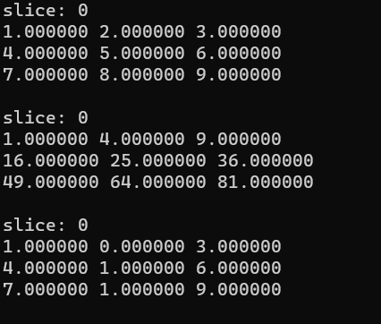
    - ### array_to_matrix
    ```C
    MATRIX* array_to_matrix(uint32_t input_rows, uint32_t input_columns, uint32_t input_slices, ...);

    Convert an array to matrix type.

    Parameter
    ... : double*, double** or double*** array according with input dimensions.
    ```
    ```C
    //Ex

    #include "c_matrix.h"

    int main(){
	    double* a = (double*)calloc(3, sizeof(double));
	    a[0] = 1.0;
	    a[1] = 2.0;
	    a[2] = 3.0;
	
	    double** b = (double**)calloc(2, sizeof(double**));
	    b[0] = (double*)calloc(2, sizeof(double));
	    b[1] = (double*)calloc(2, sizeof(double));
	
	    b[0][0] = 1.0;
	    b[0][1] = 2.0;
	    b[1][0] = 3.0;
	    b[1][1] = 4.0;
	
	    matrix_print(*array_to_matrix(1,3,1,a));
	    matrix_print(*array_to_matrix(2,2,1,b));
	
	
	    return 0;                       
    }
    ```
    
    - ### matrix_to_array
    ```C
    double*** matrix_to_array(MATRIX** a, uint8_t erase);

    Convert a matrix type to double*** array.

    Parameters
    erase : 0 or 1
            1 - free matrix after conversion
            0 - not free
    ```
